
<h1>Comandos Git</h1>

# Comandos:
## `ls`
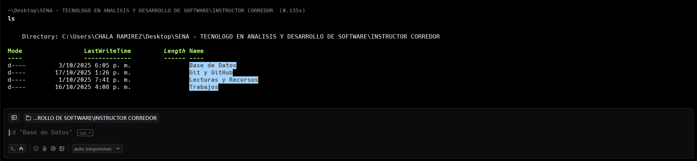

Verl contenido dentro de la ubicacion de la carpeta.

## `cd`
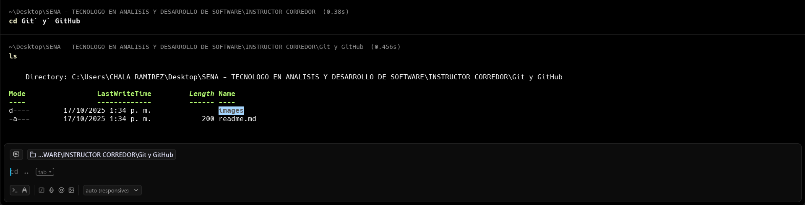

Entrar a una carpeta dentro de la ubicacion dode nos encontremos.

## `cd ..`

Comadno para salir una carpeta antes de donde nos encontramos.

## `pwd`
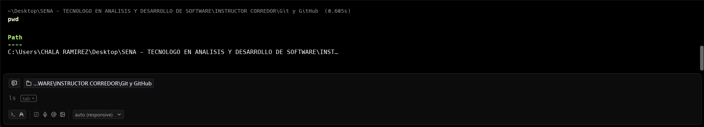

Comando para saber en que carpeta nos encontramos.

## `mkdir`
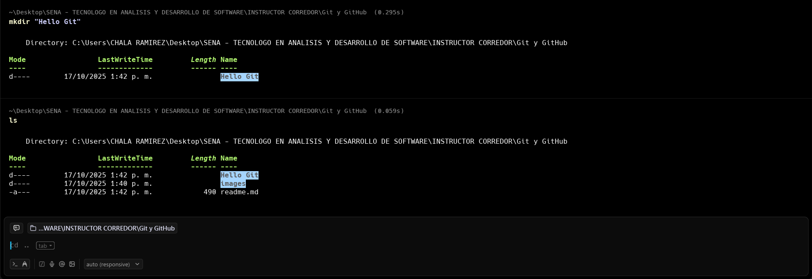

Comando para crear una carpeta donde nos encontremos.
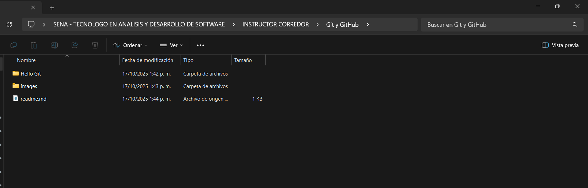

## `code .`
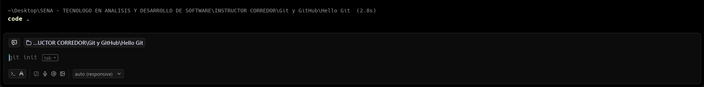

Comando para abrir la carpeta en Visual Studio Code.
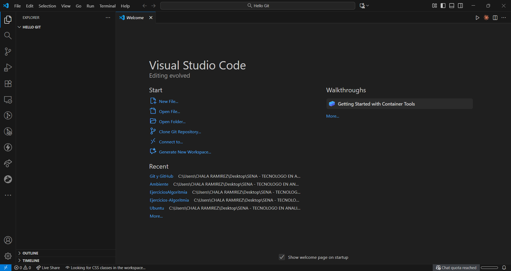

## `git config --global user.name "...`
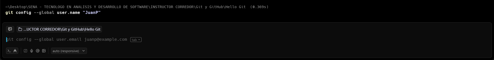

Comando para configurar de manera global el usuario.

Esto nos crea un archivo `.gitconfig` dentro de la ruta del nombre de usuario del computador

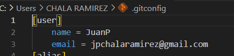

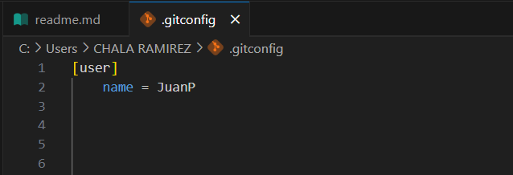

## `git config --global user.email "..."`
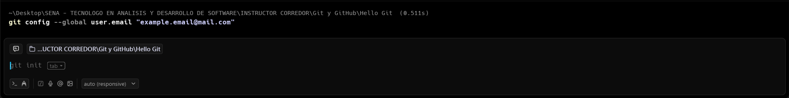

Comando para configurar de manera global el correo.

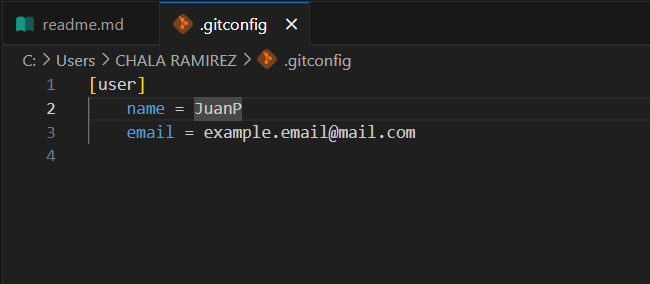

## `New-Item (touch)`
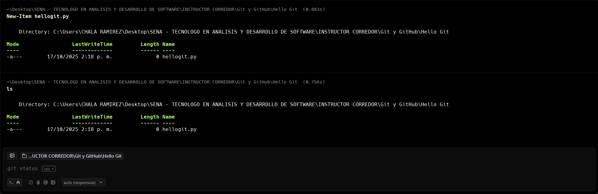

Comando para crear un archivo dentro de la carpeta

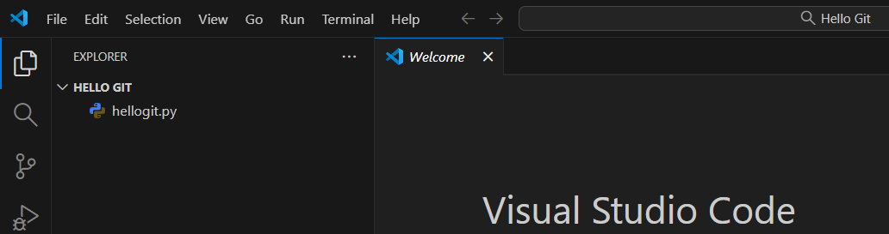

## `git init`
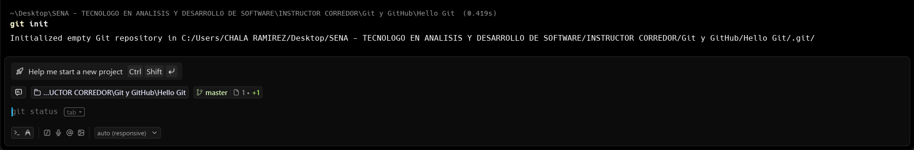

Comando para iniciar git en unestro carptea raiz donde estemos trabajando.
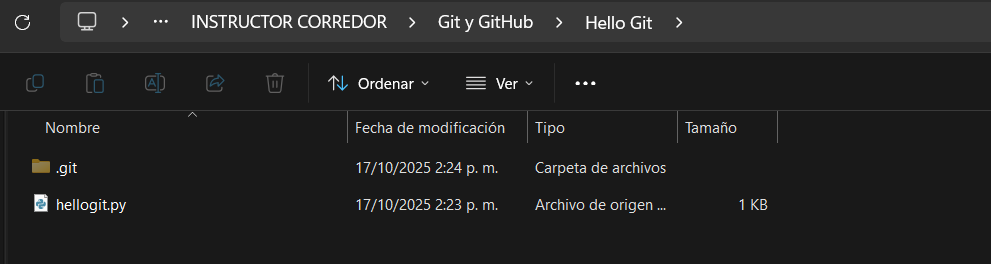

Dentro de nuestra carpeta raiz se crea una carpeta oculta llamada `.git` donde alli se encuentra informacion de nuestro proyecto y tambien de git.

Aqui en este punto ya hemos creado un repositorio en la carpeta raiz. Y nos encontramos dentro de una rama llamada `master`, esta es la rama principal de nuestro proyecto.

## `git branch -m main`
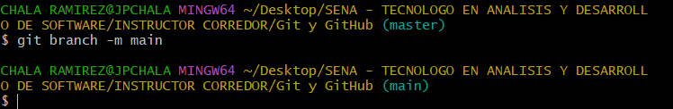

Comando para renombrar una rama.

## `git status`
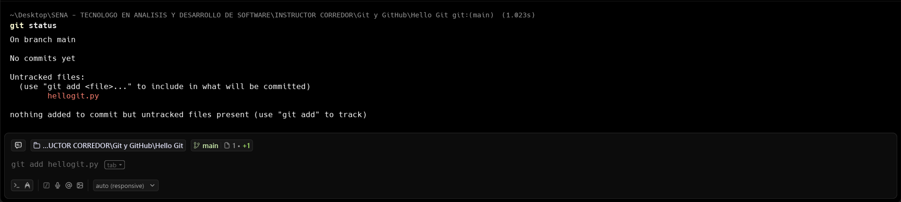

Comando para ver el estado del repositorio. Nos da informacion del contenido dentro de la carpeta y posteriormente nos dice que los archivos que se encuentran alli no estan guardados.

## `git add [nombre archivo]`
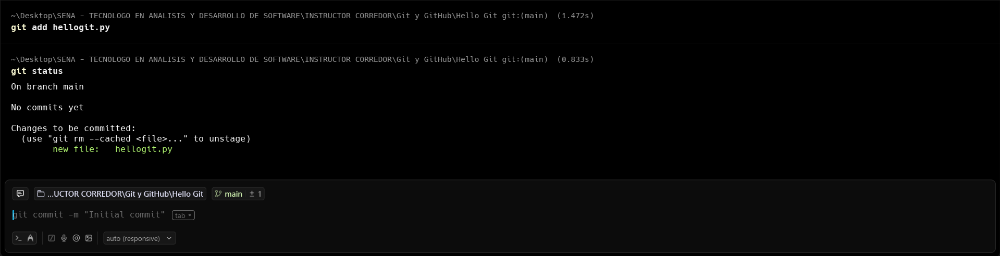

`git add hellogit.py`, comando para empezar a prepara los archivos, en este caso le dijimos que prepare el archivo `hellopython.py`.

Despues de hacer un `git status`, nos muestra que el archivo se encuentra preparado.

## `git commit -m "nombre commit"`
Comando para realizar commit. Este comando toma lo que esta preparado del `git add` y lo sube al repositorios de manera permanente, y cada vez que se realice un cambio lo toma y lo sube.

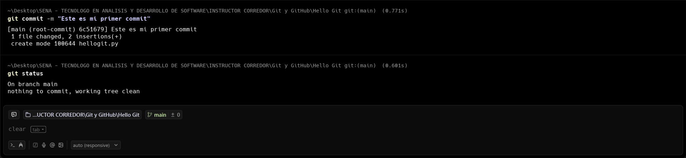

Al realizar un `git status` vemos que ya no nos dice que tenemos que crear el commit como en imagenes anteriores, porque ya hemos creado el commit.

## `git log`
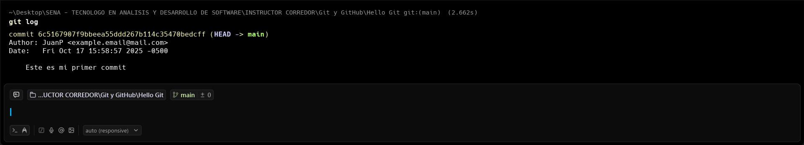

Comando para verificar si realmente el commit sea creado. Alli vemos un identificador unico para el commit, vemos el autor (usuario) y el correo, y esto nos dice que el autor (JuanP) ha creado un commit.

Hemos creado un segundo archivo dentro de la carpeta y volvimos a realizar los mismos pasos anteriores, para preparar el archivo y posteriormente subirlo al repositorio.

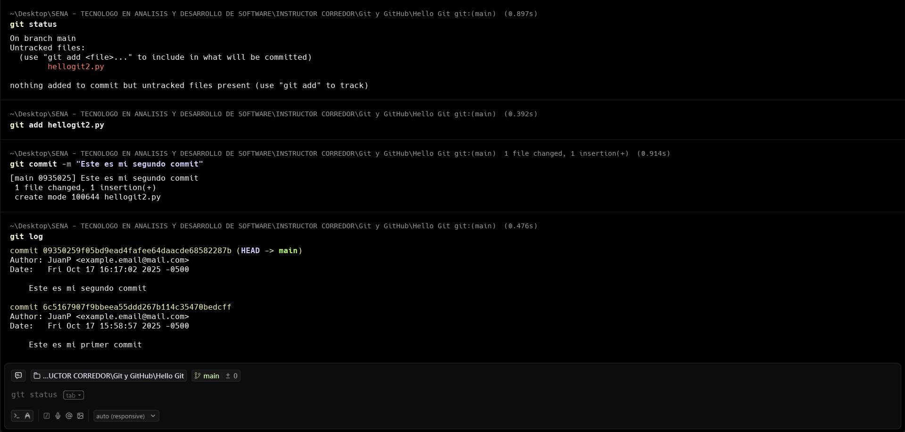

He empezado a editar los dos archivps y vemos que nos dice que aunque no son arcivos nuevos, si nos dice que hemos hecho modificaciones en los archivos

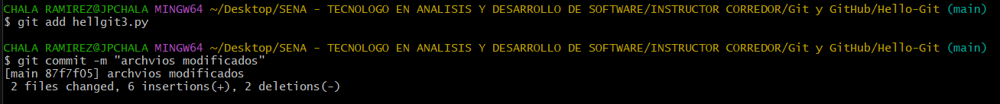

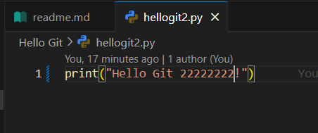

## `git checkout [nombre archivo]`
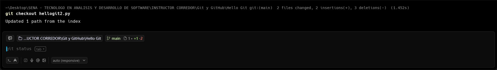

Comando para movernos entre ramas.

## `git log --graph`
Comando para ver los commit creados pero de una manera mejor, en ramas.

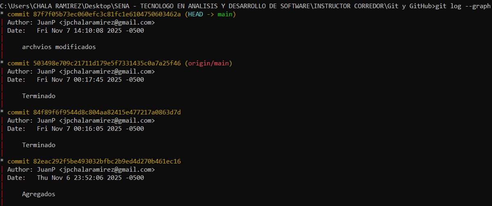

## `git log --graph --pretty=oneline`
Comando es igaul al `log` o al `log --graph`, solo se ven los commits en una sola linea.

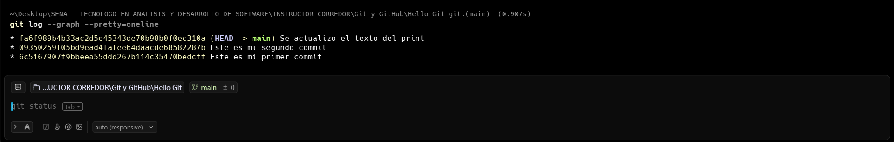

## `git log --graph --decorate --oneline`
Este comando realiza lo mismo que los anteriores, simplemente que mas corto.

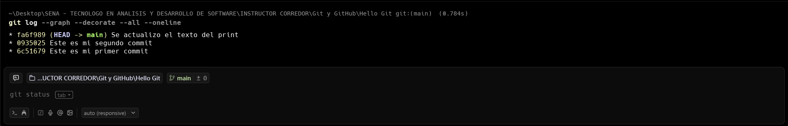

## `git config --global alias.tree "git log --graph --decorate --all --oneline"`
Este comando nos sirve para cuando no nos sabemos todos estos comandos de memoria, entonces los podemos guardar en nombre (alias) y despues ejecutar facilmente.

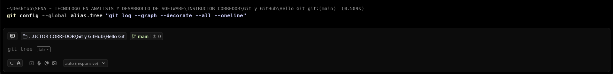

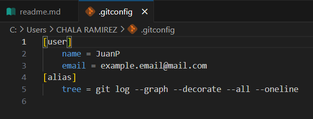

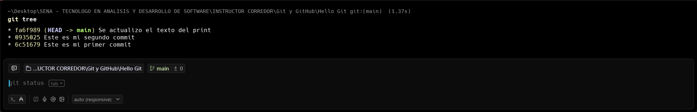

## `New-Item .gitignore`
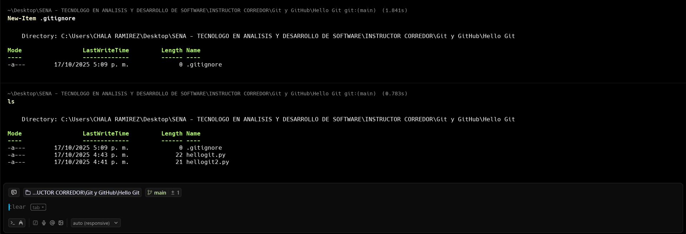

Aqui creamos un archivo llamado `.gitignore` para aqui dentro de este archivo decirle que los archivos que no queremos guardar en el repositorio.

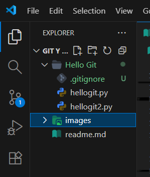

## `git clone`
Copia un repositorio remoto a tu máquina local para trabajar y unirte a un proyecto existente.

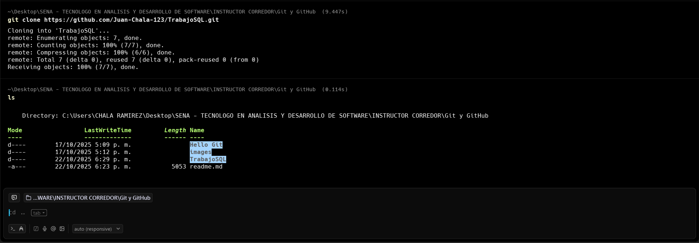

## `git remote add origin`

Permite subir el proyecto a un repositorio que se encuentra vacío en GitHub.

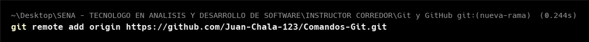

## `git diff`

Comando para ver los cambios que hemos hechos en los archivos. Nos muestra queantes teniamos algo y ahora tenemos algo diferente.

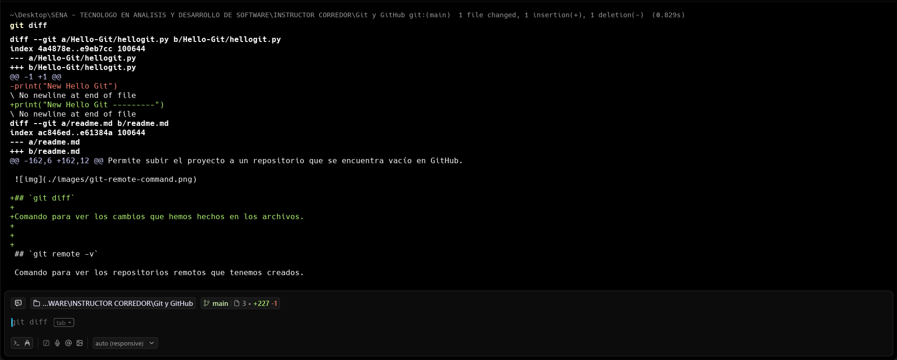

## `git reset --hard [identificador del commit]`

Permite volver a una rama en especifico.

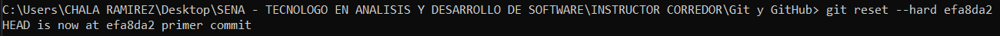

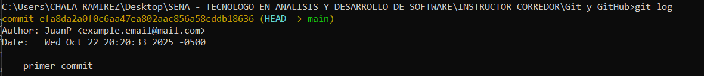

## `git reflog`

Permite ver un historial de commit creados

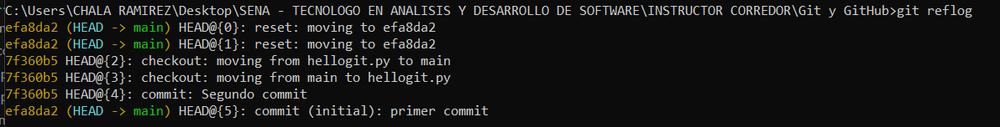

## `git tag`

Se utiliza para identificar una versión del proyecto que se ha liberado, para saber que he tenido en encuenta para la cracion de la version.

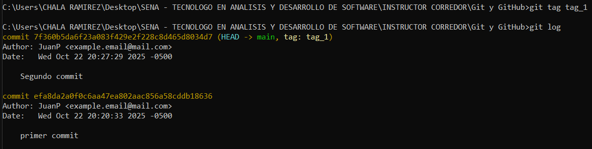

## `git brach nombre-rama`

Permite crear nuevas ramas

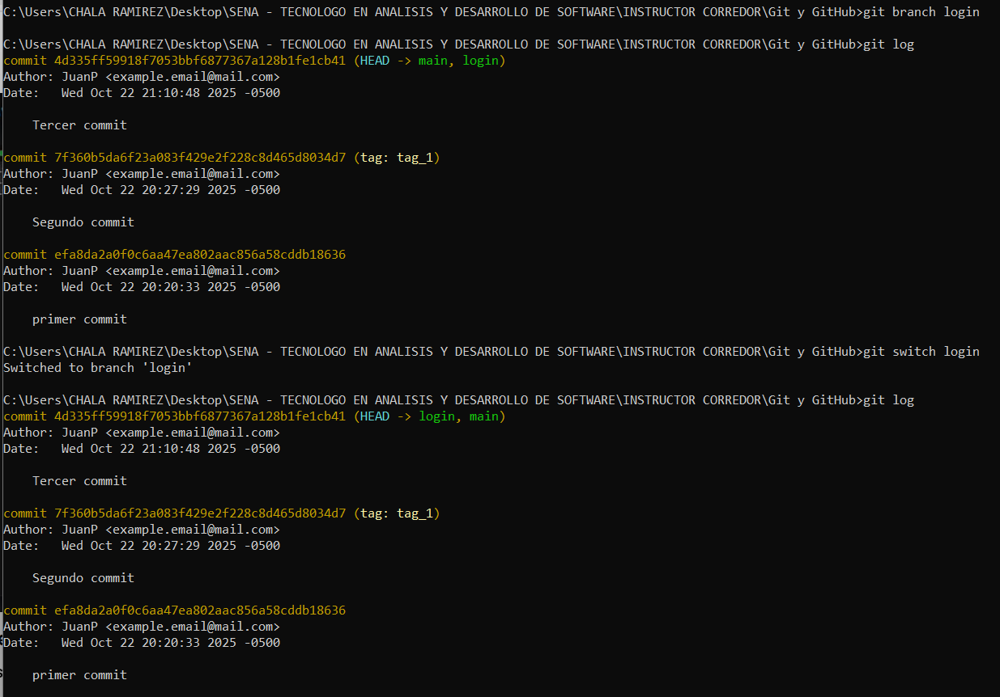

## `git switch nueva-rama`

Permite ingresar a esta nueva rama y cambiar en la que estabamos.

## `git merge`

Permite unir ramas

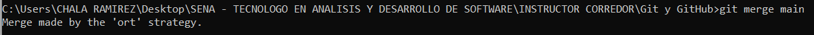

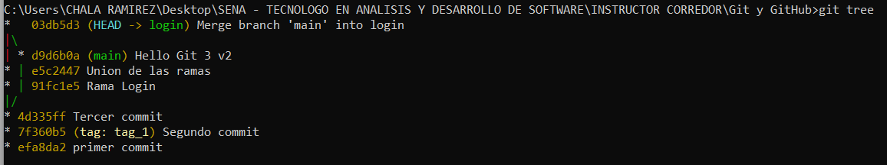

* Nota: para tener en cuenta cuando trabajemos en equipo tener encuenta a que archivos tenemos acceso y no tener conflictos.

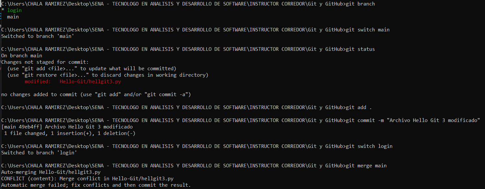

## `git remote -v`

Comando para ver los repositorios remotos que tenemos creados.

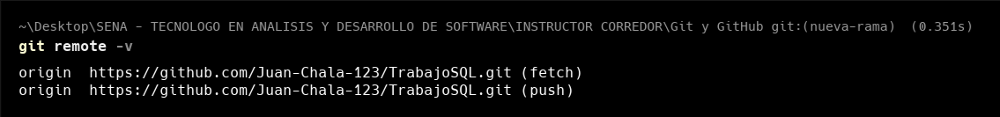

## `git pull origin main`

Descarga cambios del remoto y los fusiona, para mantener tu copia local actualizada antes de empezar a trabajar.